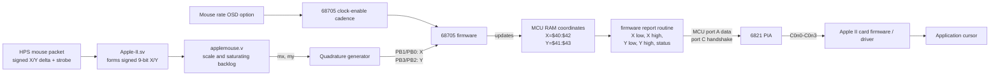
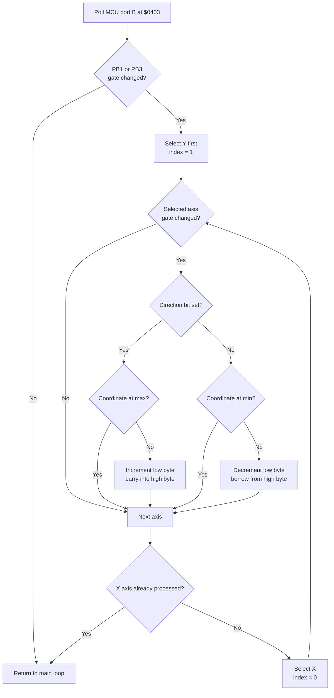
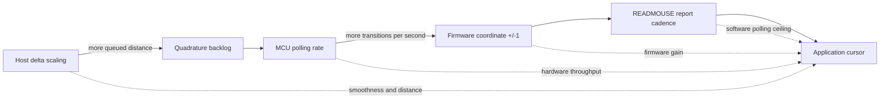

# AppleMouse X/Y Update Logic

This note traces mouse movement from a MiSTer host packet to the coordinates returned to Apple II software. It documents the active Verilog card in `rtl/mouse/applemouse.v`, the 341-0269 firmware image in `rtl/mouse/applemouse_mcu_rom.v`, and the 6821 interface.

## End-to-end path



There are two distinct rates in this path:

- **Input distance:** how many counts enter `mx`/`my` for one host packet. The Mouse scaling option controls this.
- **Output throughput:** how quickly the 68705 observes quadrature transitions and reports coordinates. The Mouse rate option changes the MCU enable cadence.

Increasing only input distance can make movement last longer and feel smoother while leaving peak cursor speed unchanged.

## 1. Host packet ingress

`Apple-II.sv` receives MiSTer's 25-bit PS/2 mouse packet. The strobe toggles when a new packet arrives. X and Y are reconstructed as signed 9-bit values:

```text
X = {ps2_mouse[4], ps2_mouse[15:8]}
Y = {ps2_mouse[5], ps2_mouse[23:16]}
```

The wrapper sends the same packet to a mouse card in slot 4 or slot 5. While the virtual keyboard is active, movement, button, and strobe are suppressed.

The OSD controls use:

| Status bits | Setting | Values |
|---|---|---|
| `46:45` | Mouse scaling | 8x, 16x, 32x, 64x |
| `48:47` | Mouse rate | 1x, 2x, 3x, 3.5x |

## 2. Scaling and backlog

On each `STROBE`, `applemouse.v` adds the signed packet delta to two signed 9-bit queues:

- `mx`: pending X counts
- `my`: pending Y counts

The scale is implemented as a signed shift by `SCALE + 3`, giving 8x, 16x, 32x, or 64x. A 16-bit intermediate prevents arithmetic overflow before the result is clamped to the queue range `-256..255`.

If a packet arrives on the same cycle that one count is consumed, `stepped_backlog()` applies the drain first and the scaled packet second. This prevents a nonblocking assignment from losing either operation.

Consequences:

- Scaling increases requested travel per host packet.
- Large packets can saturate the queue, especially at 32x and 64x.
- Scaling alone cannot exceed the rate at which queued counts become quadrature transitions.

## 3. Quadrature generation

A queued count is consumed when the 68705 reads MCU port B at address `$0001`:

```text
mcu_pb_read = mcu_cen && !mcu_wr && mcu_addr == 1
```

Each read can consume at most one X count and one Y count. Both axes may therefore advance simultaneously.

| Axis | Direction input | Gate input | Action per queued count |
|---|---|---|---|
| X | MCU PB0 | MCU PB1 | Toggle PB1; latch direction on its rising edge |
| Y | MCU PB2 | MCU PB3 | Toggle PB3; latch direction on its rising edge |

The Y direction mapping is inverted relative to the incoming MiSTer Y sign so physical up/down agrees with Apple software.

This matches the AppleMouse electrical model used by MAME: each pending count toggles the axis gate; direction is valid when the gate rises.

## 4. MCU rate

The real card's MC68705P3 is clocked near 2.0436 MHz. The core uses `CLK_14M` as its physical FPGA clock and advances only when `mcu_cen` is asserted.

The selectable rate patterns are:

| OSD rate | Enable source | Approximate intent |
|---|---|---|
| 1x | rising edge of `CLK_2M` | original card rate |
| 2x | both edges of `CLK_2M` | twice the original enable rate |
| 3x | three pulses in seven `CLK_14M` cycles | about 6.1 MHz |
| 3.5x | alternating `CLK_14M` cycles | about 7.2 MHz |

A continuous enable was tested and rejected: the MCU uses synchronous ROM/RAM, and advancing on every `CLK_14M` edge prevented the firmware from progressing. Every retained accelerated mode provides low cycles between enables.

Measured time to drain the same 40-count backlog in the focused Verilator test:

| Rate | Master-clock cycles |
|---|---:|
| 1x | 10,964 |
| 2x | 6,834 |
| 3x | 4,336 |
| 3.5x | 3,688 |

These measurements prove that the HDL queue drains faster. They do not by themselves prove that Apple software moves its cursor faster, because firmware reporting and application polling remain downstream limits.

## 5. 341-0269 firmware polling loop

The MCU reset vector points to `$03C0`. Its main quadrature poll begins at `$0403`.

```text
$0403  read MCU port B
$0405  keep PB3..PB0
$0407  compare with previous sample in RAM $44
$0409  return to main loop if no bits changed
$040E  store changed-bit mask in RAM $45
$0410  reconstruct and save current PB nibble in RAM $44
$0417  retain changed gate bits PB1/PB3
$0427  X register = 1, process Y first
$0429  select changed-bit mask from ROM table $009A,X
$0430  select direction mask from ROM table $009C,X
$0466  decrement X register and process X with index 0
$0469  return to main loop
```

Firmware tables:

| ROM address | X entry | Y entry | Meaning |
|---|---:|---:|---|
| `$009A` | `$02` | `$08` | gate/change masks: PB1, PB3 |
| `$009C` | `$01` | `$04` | direction masks: PB0, PB2 |

## 6. Coordinate counters and clamps

The firmware processes Y with index 1 and X with index 0. Indexed RAM addresses therefore map as follows:

| Value | X | Y |
|---|---:|---:|
| Coordinate high byte | `$40` | `$41` |
| Coordinate low byte | `$42` | `$43` |
| Minimum high byte | `$47` | `$48` |
| Minimum low byte | `$49` | `$4A` |
| Maximum high byte | `$4B` | `$4C` |
| Maximum low byte | `$4D` | `$4E` |

Each accepted quadrature gate transition changes the selected 16-bit coordinate by exactly one, subject to its clamp.



Exact modifying instructions:

| Firmware address | Bytes | Operation |
|---|---|---|
| `$0446` | `6C 42` | increment coordinate low byte `$42,X` |
| `$044A` | `6C 40` | increment coordinate high byte on carry |
| `$0462` | `6A 40` | decrement coordinate high byte on borrow |
| `$0464` | `6A 42` | decrement coordinate low byte |

The limit checks occur before these instructions. Replacing a single `INC` or `DEC` with an unchecked larger step would break carry, borrow, or clamp behavior.

## 7. Reporting coordinates to the 6821

The firmware report sequence begins around `$0473`. It configures MCU port A as output, then transfers these bytes in order:

1. X low from RAM `$42`
2. X high from RAM `$40`
3. Y low from RAM `$43`
4. Y high from RAM `$41`
5. status/button information

For each byte, the firmware writes the byte to MCU port A at `$00` and toggles MCU port C handshake bits. The HDL wiring is direct:

```text
MCU port A output -> PIA port A input
PIA port A output -> MCU port A input
MCU port C output -> PIA port B input bits 7:4
PIA port B output bits 7:4 -> MCU port C input
```

PIA port B bits 3:1 also select the 2 KiB card-ROM bank. PIA input bit 0 receives `D_IN[0]`, matching the retained card interface wiring.

MAME and AppleWin corroborate the protocol-level behavior:

- Command `$10` (`READMOUSE`) returns X low/high, Y low/high, then status.
- Commands include set mode, read, serve interrupt, clear, set position, initialize, clamp, and home.
- Movement and button events can assert the slot IRQ according to the mode byte.

The active RTL derives slot IRQ directly from MCU port B output bit 6:

```text
IRQ_N = mcu_pb_out[6]
```

## 8. Apple II bus visibility

The Apple II accesses the card's 6821 through the selected slot I/O region. `pia6821.v` exposes four register offsets:

| Offset | Register |
|---:|---|
| 0 | port A data or data-direction register |
| 1 | port A control register |
| 2 | port B data or data-direction register |
| 3 | port B control register |

`DEVICE_SELECT` chooses PIA data on `D_OUT`; `IO_SELECT` chooses the banked 341-0270-C slot ROM. `OE` is asserted for either selection. At machine level, `apple2_top` places the selected mouse card's `D_OUT` on the peripheral data bus and combines its active-low IRQ with the other slot IRQs.

Apple II software normally calls the card ROM entry points. The card ROM performs the PIA handshake and returns the five-byte `READMOUSE` report to the application. The final cursor speed may therefore also depend on:

- how often the application or driver calls `READMOUSE`;
- whether movement interrupts are enabled and serviced;
- how the application maps coordinate change to screen pixels;
- coordinate clamp ranges established by the application.

## 9. Where acceleration can act



- **Host scaling** increases distance but cannot raise the one-step-per-poll ceiling.
- **MCU rate** raises quadrature consumption, but the firmware and Apple-side polling can remain limiting.
- **Firmware gain** would make one accepted transition update a coordinate by more than one. A safe patch must repeat the complete clamp-aware 16-bit increment/decrement sequence, likely via a trampoline into verified unused ROM space.
- **Direct protocol emulation** would bypass the 68705 and provide the most control, but would be less hardware-faithful and substantially more invasive.

## 10. Evidence and validation status

Verified locally:

- Dynamic trace of MCU internal RAM writes and program counter.
- Static decode of the 341-0269 movement loop and report sequence.
- Focused Verilator checks for signed accumulation, saturation, simultaneous drain/arrival, X/Y quadrature polarity, and rate ordering.
- Full Verilator smoke test after integration.

External behavioral cross-checks:

- MAME `src/devices/bus/a2bus/mouse.cpp` for physical pin mapping and one-count-per-port-B-read behavior.
- AppleWin `source/MouseInterface.cpp` for command bytes, report order, clamps, status, and PIA handshake behavior.

Not yet verified:

- A firmware-gain ROM patch.
- Apple-facing `READMOUSE` bytes in an automated bus-level test.
- Quartus synthesis of the current experimental scale/rate controls.
- Cursor behavior on FPGA after a fresh build.
